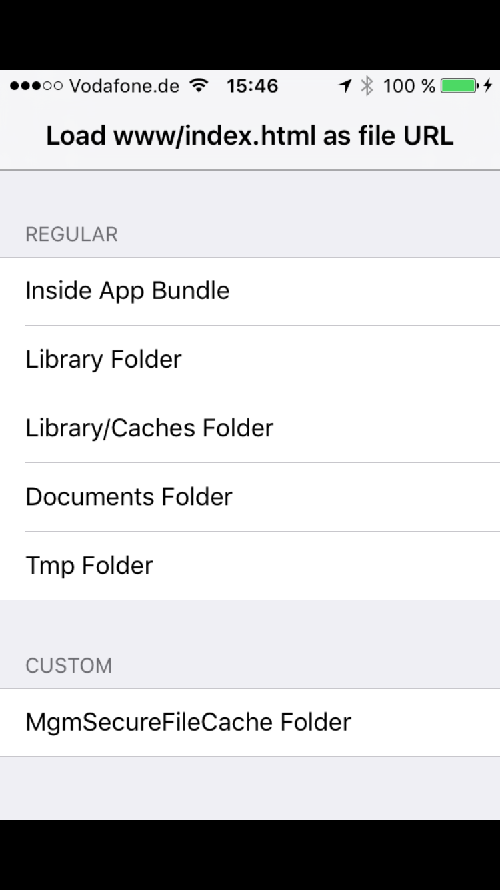

WKWebViewFileUrlTest
--------------------

A test project to demonstrate that the WKWebView class cannot load file:// urls in iOS 8 beta 4 and 5 on a device. This works in iOS 8 beta 3 on a device, and also the iOS 8 Simulator (all beta versions).

Here's the main page, where you can test file:// urls that come from inside the app bundle, the Library folder, the Documents folder, and the tmp folder.

Here's what is expected to load:

